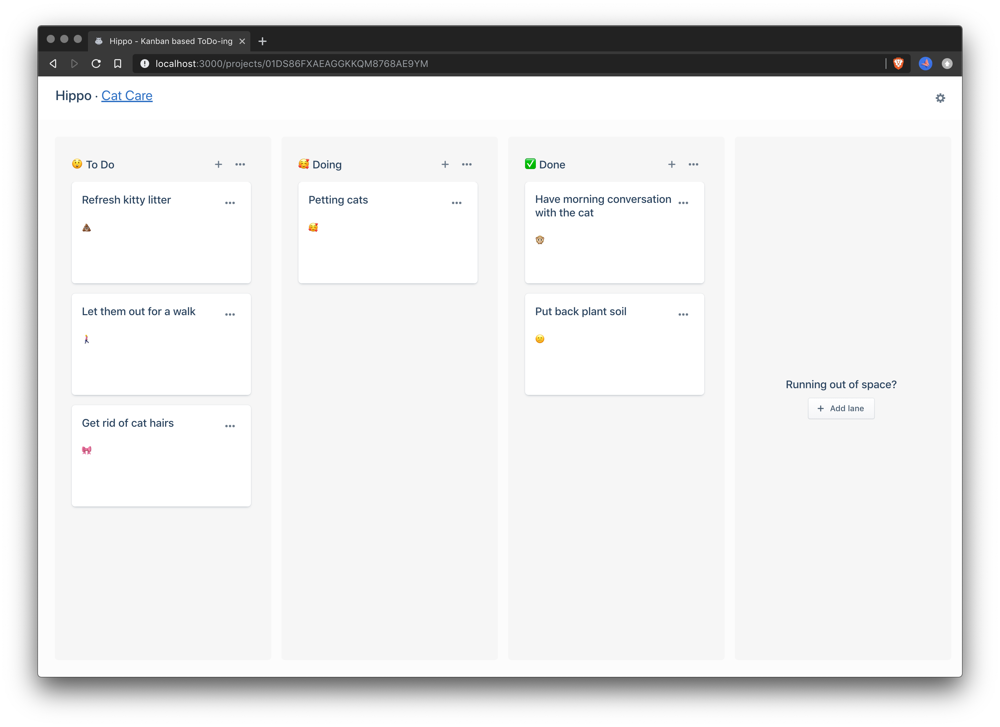

# Hippo 🦛



Hippo is a fairly basic implementation of a Kanban project board. It supports having multiple projects, per project multiple lanes and per lane multiple cards. Cards can be dragged-and-dropped to be rearranged within the same lane, or across lanes. Lanes on their turn can be dragged to be rearranged.

## Stack

The front-end is built with:

- [React JS](https://reactjs.org/) front-end using [create-react-app](https://create-react-app.dev/)
- [Evergreen UI](https://evergreen.segment.com/) component library
- [Apollo](https://www.apollographql.com/) & [React Apollo](https://www.apollographql.com/docs/react/) for Graphql communication and real-time events over Websockets.

Back-end is built using

- [Elixir](https://elixir-lang.org/) as a programming language
- [Phoenix](https://phoenixframework.org/) as the HTTP framework
- [Absinthe](https://absinthe-graphql.org/) for handling all things GraphQL
- [PostgreSQL](https://www.postgresql.org/) for storing the data

## Why Hippo?

Hippo is built as an excercise project for me to get familliar with the tech
stack as described above.

# Running Hippo

The easiest way to take Hippo for a spin is by using the Docker image as described below. However should you want to tinker with its insides, I'd recommend to run the parts individually on your local machine.

## Running with Docker

by far the easiest way to toy with this little project is by running with Docker. Either by building from scratch (including its Postgres dependency) or running the pre-baked Docker image from Docker hub.

### Build and run Docker from source using Docker Compose

```bash
  git clone git@github.com:Tmw/Hippo.git
  cd hippo
  docker-compose up
```

### From Dockerhub

```bash
docker run \
  -e DB_HOST=localhost \
  -e DB_USER=hippo \
  -e DB_PASS=hippo \
  -e DB_NAME=hippo \
  hippo_hippo-app
```

_Note_ this approach expects you to setup and link a Postgresql database yourself as configured in the environment variables. The docker container will run its migrations against the provided database on startup.

## Dunning on your machine

**Requirements**

- Elixir v1.9.1
- PostgresQL
- Node v10.x

**Getting started**

To run Hippo front-end on your local machine

```bash
  git clone git@github.com:Tmw/Hippo.git
  cd hippo
  cd hippo-frontend && npm start
```

Run the back-end

```bash
  cd hippo-backend
  mix deps.get
  mix ecto.create
  mix ecto.migrate
  iex -S mix phx.server
```

# Extracting updated Fragment / Union types

In order for Apollo to resolve Fragments and Unions into their concrete types, it needs a little guidance from our back-end schema. Writing updates of the schema to disk can be done by running:

```bash
npm run get_fragment_types
```

The extracted fragment_types will be written to `src/graphql/fragmentTypes.json`

# License

[MIT](LICENSE)
